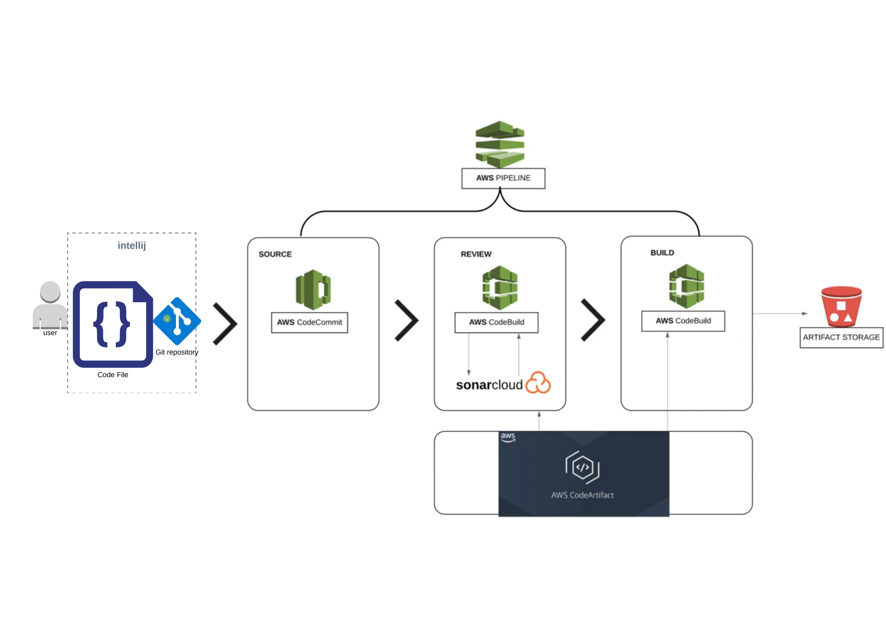

# Continuous Integration on AWS Cloud

## Scenario
- Agile SDLC
- Developers make regular code changes.
- These commits needs to be Build & Tested.
- Usually Build & Release Team will do this job.
- Or Developers responsibility to merge and integrate code.
  
## Problem Issues with current situation
- In an Agile SDLC, there will be frequent code changes. 
- Not so frequently code will be tested.
- Which accumulates bugs and error in the code.
- Developers need to rework to fix these bugs and error.
- Manual build & Release process.
- Inter Team Dependencies.

## Solution
- Build & Test for every commit.
- Automated Process.
- Notify for build status.
- Fix code if bugs or error found instantly rather than waiting.

## Problem with CI Server
- CI Server maintenance.
- Operational overhead to maintain server like Jenkins, Nexus, Sonar, Git etc.
  
## Solution
 - Cloud services for CI to remove OPS overhead.

## Benefits
- CI Pipeline on AWS
  - Fault Isolation
  - Agile 
  - No OPS
  - Short MTTR
  - No Human Intervention

## AWS Services
- Code Commit (Version Control System)
- Code Artifact (Maven Repository for Dependencies)
- Code Build (Build Services from AWS)
- Code Deploy (Artifact Deployment Service)
- Sonarcloud (Sonarqube cloud based tool)
- Checkstyle (Code analysis from build job)
- Codepipeline (Service to integrate all jobs together)

## Architecture of CI Pipeline

## Flow of execution
- Login to AWS account
- Code Commit
  - Create codecommit repo
  - Create IAM user with codecommit policy
  - Generate ssh keys locally
  - Exchange keys with IAM user
  - Put source code from github repo to cc repository and push
- Code Artifact
  - Create an IAM user with code artifact access.
  - Install AWS CLI, configure 
  - Export auth token
  - Update settings.xml file in source code top level directory with below details.
  - Update pom.xml file with repo details
- Sonar cloud 
  - Create sonar cloud account 
  - Generate token
  - Create SSM parameters with sonar details
  - Create Build project 
  - Update codebuild role to access SSMparameterstore
- Create notifications for sns or slack
- Build Project
  - Update pom.xml with artifact version with timestamp.
  - Create variable in SSM => parameterstore
  - Create build project
  - Update codebuild role to access SSMparameterstore.
- Create Pipeline 
  - Codecommit
  - Testcode
  - Build
  - Deploy to s3 bucket
- Test Pipeline